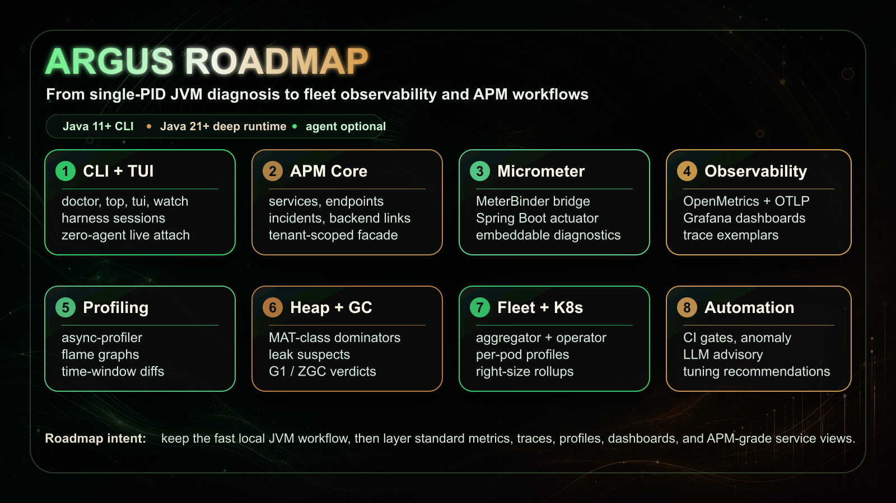

# Argus Documentation

Welcome to the Project Argus documentation.

## Getting Started

- [Getting Started](getting-started.md) — Installation, prerequisites, and first commands
- [Usage Guide](usage.md) — CLI and Agent dashboard fundamentals

## Reference

- [CLI Command Reference](cli-commands.md) — Index of all 71 commands with category navigation and A–Z lookup
  - [commands/monitoring.md](commands/monitoring.md) — ps, info, env, top, watch, report, diff, alert, cluster, perfcounter, tui
  - [commands/memory-gc.md](commands/memory-gc.md) — gc, heap, histo, nmt, buffers, metaspace, gclog, gcscore, zgc, and more
  - [commands/profiling-tracing.md](commands/profiling-tracing.md) — profile, flame, jfr, jfranalyze, slowlog, trace, benchmark
  - [commands/runtime-internals.md](commands/runtime-internals.md) — vmflag, vmset, doctor, suggest, ci, spring, logger, mbean, and more
  - [commands/threads.md](commands/threads.md) — threads, threaddump, deadlock, pool
- [Configuration](configuration.md) — Configuration options and performance tuning
- [Architecture](architecture.md) — System design, provider architecture, and extensibility
- [Dashboard Metric Contract](dashboard-contract.md) — Shared Grafana/local dashboard metric and drilldown contract
- [APM Facade Contract](apm-facade-contract.md) — Planned public APM control-plane boundary and security contract
- [APM Security Guardrails](apm-security.md) — Ingress, auth, cardinality, and facade self-observability guardrails

## Operations

- [Kubernetes](kubernetes.md) — Deployment, metrics scraping, and Prometheus integration
- [Troubleshooting](troubleshooting.md) — Common issues, diagnostics, and solutions

## Studies & Reports

- [Comparison: Argus vs Traditional Tools](comparison-argus-vs-traditional.md) — Time-to-insight benchmark study
- [Benchmark Report](benchmark-report.md) — Performance metrics and throughput analysis

## Reference Assets

- [Grafana Dashboard](grafana-dashboard.json) — Import-ready dashboard template
- [Prometheus Config](prometheus.yml) — Example scrape configuration

## What is Argus?

Argus is a lightweight, zero-dependency JVM diagnostic toolkit. CLI works on Java 11+, Dashboard on Java 17+, full features on Java 21+. It provides:

- **71 CLI Commands** — process info, memory, GC (including ZGC live diagnosis), threads, profiling, class search, JFR analysis, log level control, and more
- **Real-time Dashboard** with interactive charts, flame graphs, and interactive console
- **No Agent Required** — diagnose any running JVM via `jcmd` (agent optional for richer data)
- **Java Version Adaptive** — MXBean polling on Java 17-20, JFR streaming on Java 21+
- **Multi-language** — English, Korean, Japanese, Chinese
- **Spring Boot Starter** — zero-config auto-configuration for Spring Boot 3.2+
- **Micrometer Integration** — standard metrics bridge for any Micrometer-compatible framework
- **Prometheus Endpoint** for metric scraping
- **OTLP Export** for pushing metrics to OpenTelemetry collectors

## Roadmap At A Glance

The roadmap keeps Argus anchored in fast local JVM diagnostics while expanding into standard metrics, traces, profiles, dashboards, fleet rollups, and APM-grade service workflows.

## Quick Links

- [GitHub Repository](https://github.com/rlaope/argus)
- [Documentation Site](https://rlaope.github.io/Argus/)
- [Releases](https://github.com/rlaope/argus/releases)
- [Issue Tracker](https://github.com/rlaope/argus/issues)
